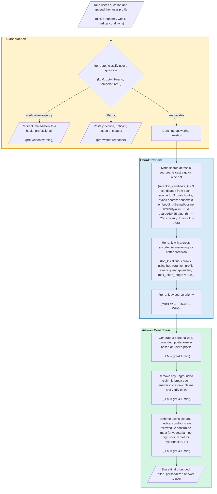
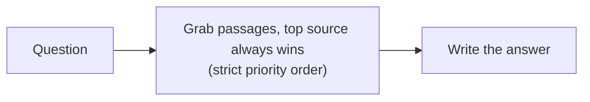
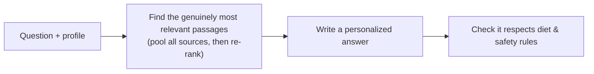
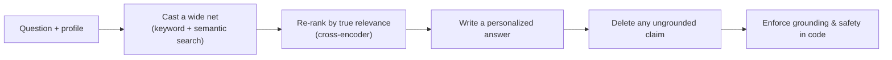

# Poshan Saathi — A Nutrition RAG Chatbot for Pregnant Indian Women

**TL;DR**: Poshan Saathi ("nutrition companion" in Hindi) is a RAG chatbot I built to answer pregnancy-nutrition questions for women in India. 

**The problem**: The Indian diaspora has specific dietary requirements (ovo-vegetarian and vegetarian are common) and medical conditions (anemia and diabetes are common), while most maternal nutrition advice is generic, unsourced, or written for a Western diet. 

**My solution**: I built a system designed specifically for the Indian pregnant woman, sourcing nutritional guidance directly from India's Ministry of Health, India's FOGSI obstetrics federation, and the WHO as a fallback, while tailoring every answer to the woman's diet, trimester, and medical conditions.

**Why this problem**: I was a quarterfinalist for The Gates Foundation’s AI Fellow Program (top 20/4500+ applicants, ie top 0.4%) where we were asked to build a prototype of an antenatal chatbot. I chose to bring my prototype to production using state-of-the-art RAG techniques to upskill my AI skillset and to bring a working solution to a real problem! Here’s a peek into how I approached this project. 🥰


## Technology Stack


| Layer | Technologies |
|---|---|
| **Frontend** | Next.js, React, TypeScript, Tailwind CSS, Vercel |
| **Backend** | FastAPI, Python, Upstash Redis, Docker, Render |
| **AI / RAG** | OpenAI, Pinecone, BM25, LangChain, LlamaIndex |
| **Observability & Eval** | Langfuse, RAGAS, Claude |
| **Dev Tooling** | Claude Code, Git, GitHub |


## Does it work? Results at a glance

I evaluated across 30 diverse test cases using RAGAS and a cross-vender judge (Claude) on these 3 core metrics to assess the system's performance. Here are the results averaged over 3 runs to take variance into account:


| Metric                | Score     | In plain English                                                                              |
| --------------------- | --------- | --------------------------------------------------------------------------------------------- |
| **Context precision** | **0.92** | How well did we rank and retrieve the relevant chunks, given the user's input?                |
| **Faithfulness**      | **0.85** | How faithful is each claim? (ie how well is it *not* hallucinating?) |
| **Answer relevancy**  | **0.93** | How relevant is our answer to the user's question?                                            |

### Deconstructing the metrics
The core of my approach was built around these 3 metrics, as I iteratively built my solution based on how these metrics were moving. Here's a quick motivation for why these 3 metrics cover the system performance end-to-end. 


## Approaching the challenge
**Co-creating with user research**: As someone who has not personally experienced pregnancy, I knew from the start that co-creating with real user input was essential. To understand the realities of pregnancy, I conducted a user interview with my mom. I learned that as an Indian vegetarian, she struggled to get nutritional guidance specific to her diet. Recognizing that the Indian diaspora has diverse dietary restrictions, I realized I could design this product to meet their specific needs.

**Following AI frameworks & ethical guidelines**: I guided my vision, approach, and inspiration from [The Gates Foundation's AI guiding principles](https://www.gatesfoundation.org/ideas/articles/artificial-intelligence-ai-development-principles) and [the projects it has funded](https://www.gatesfoundation.org/about/committed-grants?q=maternal%20health#committed_grants). Since I was designing for Indian citizens, I ensured national AI governance rules were met by following [its ethical guidelines](https://www.icmr.gov.in/icmrobject/custom_data/pdf/Ethical-guidelines/Ethical_Guidelines_AI_Healthcare_2023.pdf).

**Personalizing the user experience**: I used the 3 common diets in the Indian diaspora (fun fact: every food item in India has a 🟢/🟡/🔴 label to denote what animal product may be in the ingredients), common medical conditions, and the metric system to personalize the user experience to Indians. Even the name, Poshan Saathi (nutritional companion), is meant to evoke comfort in Hindi, a native language in India.


| Dimension                 | What I designed for                                   |
| ------------------------- | ----------------------------------------------------- |
| Diet                      | 🟢 Vegetarian, 🟡 Ovo-Vegetarian, 🔴 Non-Vegetarian    |
| Common medical conditions | Anemia (low iron), Hypertension, Diabetes             |
| Units                     | Metric (kg, cm) — India uses the metric system        |


## Choosing the data / the knowledge base

The point of this project was to upskill in AI/RAG to produce reliable answers from vetted, pertinent data sources instead of using a general LLM (ie ChatGPT), so I chose which data to include thoughtfully: 

- **Prioritizing localization**: To keep answers locally relevant, I prioritized / ordered by regional governing body (India’s MoHFW), then regional professional organization (India’s FOGSI), and finally defaulted to global organization (WHO), 

- **Data freshness**: All sources were published in the last 5 years to ensure most up-to-date guidelines. 

- **Scaling**: I created a knowledge_base_dictionary table to maintain the metadata of the data pulled to maintain data hygiene as the number of sources would grow. Perhaps we’d want to replace sources after a certain number of years, or balance how many sources from a specific origin, or weigh different sources differently, or A/B test different combinations of data sources, or keep track of different versions deployed over time, or leave remarks on the data sources. Any and more of these hypotheticals are obtainable from a simple data dictionary. :D

| doc_id | file_name | file_type | doc_title | doc_language | org_geographic_scope | org_official_name | org_display_name | doc_source | doc_year_published | doc_num_pages | doc_reference_order | doc_description | doc_intended_use |
|---|---|---|---|---|---|---|---|---|---|---|---|---|---|
| 1 | anc_guidelines_india_mohfw | pdf | Training Manual on Care During Pregnancy and Child Birth | English | India | Ministry of Health and Family Welfare | MoHFW | [PDF](https://nhsrcindia.org/sites/default/files/2021-12/Care%20During%20Pregnancy%20and%20Childbirth%20Training%20Manual%20for%20CHO%20at%20AB-HWC.pdf) | 2021 | 80 | 1 | An Indian governing body's ANC guidelines | Primary source, given doc is both regional and governing |
| 2 | anc_guidelines_india_fogsi | pdf | Routine Antenatal Care for the Healthy Pregnant Women | English | India | Federation of Obstetric and Gynaecological Societies of India | FOGSI | [PDF](https://www.fogsi.org/wp-content/uploads/2024/08/Binder_Routine-Antenatal-Care-for-the-Healthy-Pregnant-Women.pdf) | 2024 | 28 | 2 | An Indian professional organization's ANC guidelines | Secondary source, given doc is regional yet professional organization |
| 3 | anc_guidelines_global_who | pdf | WHO antenatal care recommendations for a positive pregnancy experience | English | Global | World Health Organization | WHO | [PDF](https://iris.who.int/server/api/core/bitstreams/cb09dd39-1cfc-432c-9baf-feb6a5c40aa4/content) | 2021 | 40 | 3 | A global organization's ANC guidelines | Tertiary source, given doc is global organization |


---

## Architecture diagram

This architecture was built iteratively. The main components include user input → message classification → chunk retrieval → answer generation. I've broken it down in more detail in this Mermaid diagram, including the parameters used.



---

## The philosophy behind the decisions

If I had to point to the one thing that made this project work, it wouldn't be a model or a library — it would be building the ability to *see and measure* what the system was doing before trying to improve it. That instinct is the first of several ideas that shaped almost every decision below. Here they are at a glance, each with the concrete moment on this project that taught it to me.


| Principle                                             | What it means                                                                                           | Where it showed up                                                                                                                                                                                          |
| ----------------------------------------------------- | ------------------------------------------------------------------------------------------------------- | ----------------------------------------------------------------------------------------------------------------------------------------------------------------------------------------------------------- |
| **Instrument before you optimize**                    | You cannot fix what you cannot see — build tracing and evaluation *first*, then let them drive the work | I only found that *every* retrieved passage was coming from one source, and that near-zero re-ranker scores were really a *chunking* problem, by staring at Langfuse traces and reading the actual passages |
| **Trust a number only once you know how noisy it is** | A single measurement can lie; pin down the variance before believing a result                           | The same answer scored anywhere from 0.0 to 0.78 across judge runs, so temperature 0 and multi-run averaging came *before* I claimed any change had worked                                                  |
| **Isolate one variable before blaming anything**      | Change one thing at a time, and prove the cause before attributing it                                   | A faithfulness drop that looked *obviously* like the new document parser turned out — after a git-bisect — to be an unrelated prompt change; the obvious culprit was innocent                               |
| **Think in second-order effects**                     | The knobs aren't independent — trace the ripples before flipping a switch                               | Turning on hybrid search quietly filtered out water-intake queries, so I lowered the threshold, which then had to still surface rare words like *amla* — one change forcing three                           |
| **No untunable magic numbers**                        | Put the intent in the *structure*, not in hand-tuned knobs someone has to babysit                       | I rejected additive source-priority nudges (+0.02 for the top source); instead priority lives in the *ordering* — sort by authority, then relevance — with nothing to hand-tune                             |
| **Recalibrate — don't rip it out**                    | When a safeguard mis-fires after a change, re-tune it for the new regime rather than deleting it        | My relevance threshold mis-fired after the switch to hybrid search; the fix was re-tuning it, not removing the filter                                                                                       |
| **Enforce in code what you can detect mechanically**  | If you can catch it with a check or a regex, don't demote it to a hopeful prompt instruction            | Small models ignore "don't make things up" even at temperature 0, so ungrounded claims, evasive openers, and "180 days" → "daily" rewrites get caught by a real verification pass                           |


---

## How I debug a bad answer

Aggregate scores tell you *something's* off; they don't tell you *what*. So when a run comes back with a few weak cases, I go one by one and trace each answer down to the layer that actually caused the problem. On a small set I read the outputs by hand; at scale I let the eval scores point me at the cases worth opening. The loop is roughly this:

1. **Read the answer first.** Is it genuinely wrong, is it evasive and non-committal, or is it actually fine but scored harshly? (RAGAS, for example, would hand a 0 to an answer that *opened* with "the guidelines don't say, but a related point is…" even when that related point was correct — a scoring quirk to work around, not a bad answer.)
2. **Look at what was retrieved.** Did the right source passage even come back? If it didn't, the problem is upstream — chunking, the search signal, or the threshold — and no amount of prompt tuning will save it.
3. **If the right passage came back but ranked low**, it's a re-ranking problem.
4. **If the right passage is there and ranked well but the answer ignored it or hedged**, it's a prompt problem — too strict, or contradicting itself with its own examples.
5. **If the answer said something that isn't in any passage**, it's a grounding problem, and it belongs in the verification pass, not in a politely-worded prompt.

Then I fix at that layer and re-run. A few real cases this led to: near-zero re-ranker scores that turned out to be a *chunking* problem (long chunks burying the one relevant sentence); every passage coming from a single source (a fix to how I pooled and ordered candidates); and a faithfulness score that swung wildly run to run, which was a *measurement-noise* problem — solved with temperature 0 and averaging, not by touching the answer code at all.

> **From my project notes:** *"It's been really fun looking at the actual outputs and seeing where to make tweaks. On a small set I can read them by hand; at scale I look at the eval scores, find the low ones, and dig in — is the answer wishy-washy? What do the retrieved passages look like? Is it the re-ranking, the selection, or a too-strict prompt?"*

---

## The key decisions, and why I made them

Every choice here is an "I picked X over Y, because Z, and here's what it cost." The reasoning matters more than the picks.


| Decision                  | I chose                           | Over                                        | Because                                                                                                                                                                                             | What it cost                                                                                 |
| ------------------------- | --------------------------------- | ------------------------------------------- | --------------------------------------------------------------------------------------------------------------------------------------------------------------------------------------------------- | -------------------------------------------------------------------------------------------- |
| **How I debug & iterate** | A full tracing + evaluation layer | Ad-hoc prints and eyeballing outputs        | I couldn't make sound architectural calls blind — I needed to see every intermediate step and put a number on every change (this is what surfaced nearly every problem below)                       | Upfront time building Langfuse tracing, test cases, and a RAGAS suite before the "real" work |
| **Safety guardrails**     | An LLM classifier                 | Keyword matching                            | Keyword rules flagged *"keep my blood sugar in check"* as an emergency (it contains "blood") and missed real emergencies phrased without any trigger word                                           | One extra quick LLM call per message — an easy trade in a health setting                     |
| **Retrieval**             | Pool everything, then re-rank     | A strict "top source always wins" waterfall | The waterfall let a barely-relevant top-source passage beat a highly-relevant one from another source; pooling then re-ranking fixes relevance while I keep source priority in the final *ordering* | A bit more compute per question                                                              |
| **Re-ranker hosting**     | Self-hosting the bge model        | Pinecone's hosted re-ranker, or Cohere      | I hit Pinecone's free monthly limit, and bge is already top-tier — Cohere's "state of the art" pitch didn't justify a new paid dependency                                                           | A one-time ~600 MB model download; it runs locally                                           |
| **Chunking**              | Semantic + header-aware splitting | Fixed 600-character chunks                  | Passages were scoring ~0.01 not because re-ranking was broken, but because long chunks buried the one relevant sentence — the fix was upstream                                                      | Chunks vary in length, so I added a token cap as a backstop                                  |
| **Search signal**         | Hybrid keyword + semantic         | Pure semantic search                        | Rare Indian-context words (amla, ragi, jaggery) need literal keyword matching that semantic embeddings smooth over                                                                                  | It briefly hurt precision until I recalibrated the threshold                                 |
| **Personalization**       | A strict profile schema           | Free-form prompt text                       | The system refuses to even start if any diet or condition is missing its rule, so personalization can never silently disappear                                                                      | Essentially free — it's stricter, not slower                                                 |
| **Anti-hallucination**    | A verification pass in code       | Trusting the prompt                         | The model ignored "don't make things up" even at temperature 0; a claim-by-claim check enforces grounding mechanically                                                                              | One always-on verification call per answer                                                   |
| **Evaluation judge**      | RAGAS + a Claude judge            | A custom judge, or a GPT judge              | Using Claude to grade GPT's answers avoids a model quietly favoring its own family, and a standard framework beats a scoring rubric I'd have to defend myself                                       | Needs an Anthropic key, but only for evaluation                                              |
| **Answer model**          | `gpt-4.1-mini`                    | The cheaper `gpt-4.1-nano`                  | nano was just as faithful, but mini gave a reliable relevancy bump (0.88 → 0.93) with steadier results                                                                                              | ~5× nano's price — negligible at this volume                                                 |


---

## How the pipeline grew up

The architecture went through five real versions over about three months. I'm showing how the *shape* changed rather than a tidy "scores went up" chart, because — as I explain in the next section — the scores didn't climb so much as plateau, and pretending otherwise would be dishonest. Here are three representative stages, with the same "what it does" labeling as before.

**v1 — the naive first pass.** Just grab passages, let the most authoritative source win, and answer. Simple, but it would happily cite a barely-relevant passage just because it came from the top-priority source.




**v3 — relevant, personal, and safer.** Now I gather candidates from every source and re-rank them by actual relevance, tailor the answer to the user's profile, and run a first safety check on the result.




**v5 — the current system.** Hybrid keyword+semantic search, smarter chunking, and — the big one — I stopped trusting the model to stay grounded and started enforcing it: every claim gets checked against a source, and safety rules are applied in code.




---

## What actually helped (and what didn't)

Here's the most senior thing I took away from this project: **the scores plateaued, they didn't climb.** After the first few weeks, all three metrics bounced around inside a band of noise that was wider than most of my individual changes. So instead of taking credit for every wiggle, I started asking which changes actually *held up* once I averaged across many runs.

**The things that genuinely moved the needle were structural, not cosmetic:**

- Switching to a cross-vendor judge (Claude grading GPT), which removed a subtle score inflation.
- Enforcing personalization through a schema instead of hoping the prompt remembered.
- The claim-by-claim grounding check and the in-code safety rules — enforced, not requested.
- Trimming the candidate pool so fewer weak passages made it through.
- And — just as important — **reducing the noise itself**, with temperature 0 and multi-run averaging, because until I did that I literally couldn't tell signal from luck.

**And the dead-ends, which I kept in the record on purpose** — a measured failure is worth more than an untested success:


| Dead-end                             | Why I walked it back                                                                                              |
| ------------------------------------ | ----------------------------------------------------------------------------------------------------------------- |
| **HyDE** (a query-rewriting trick)   | Made every metric worse on this structured-guideline corpus — a good re-ranker already does what HyDE is meant to |
| **"Temperature 0.1 is better"**      | Turned out to be a single noisy measurement — exactly the trap I later learned to avoid                           |
| **Cohere's re-ranker**               | I'd framed it as the "SOTA" upgrade, then realized my constraint was hosting cost, not model quality              |
| **A hardcoded forbidden-foods list** | Too rigid to tell "avoid chicken" from "include chicken," so it became the smarter LLM-based validator instead    |


The full run-by-run detail is in `[docs/ARCHITECTURE_HISTORY.md](docs/ARCHITECTURE_HISTORY.md)`.

---

## Running it yourself

```bash
# 1. Install (editable, so imports resolve from anywhere)
pip install -e .

# 2. Configure — copy the template and add your keys
cp .env.example .env      # OpenAI + Pinecone required; Anthropic only for eval

# 3. One-time setup: parse the PDFs, chunk, embed, and load into Pinecone
python -m scripts.ingest

# 4. Start the API
uvicorn backend.app.main:app --reload
#   POST /chat   → { message, user_profile } → a grounded, cited answer
#   GET  /health

# 5. Score answer quality (RAGAS, averaged over 3 runs)
python -m eval.ragas_eval --runs 3
```

## Where things live


| Path                           | What's there                                                                         |
| ------------------------------ | ------------------------------------------------------------------------------------ |
| `backend/app/chat/`            | The pipeline, the message classifier, and the post-answer validator                  |
| `backend/app/rag/`             | Retrieval (hybrid search + re-ranking), chunking, embedding, and HyDE (kept but off) |
| `backend/app/config.py`        | Every tunable knob, in one place, overridable by environment variable                |
| `eval/`                        | The RAGAS harness, routing tests, four user personas, and 92 archived reports        |
| `scripts/`                     | One-time ingestion plus retrieval-debugging tools                                    |
| `docs/ARCHITECTURE_HISTORY.md` | The exhaustive engineering archive                                                   |


