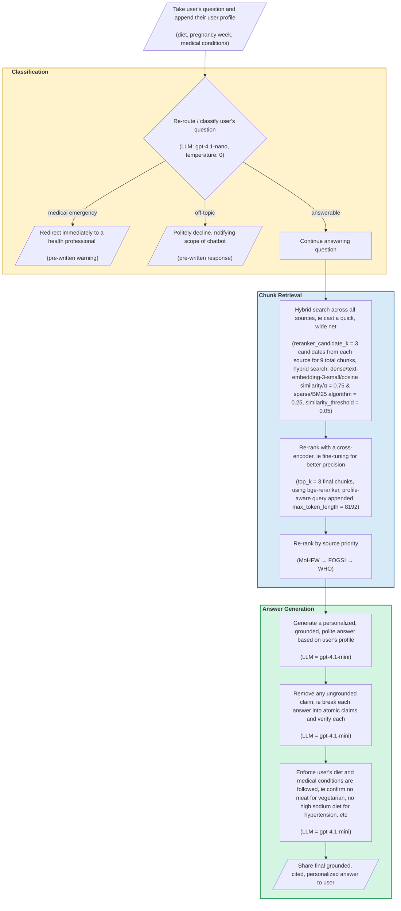
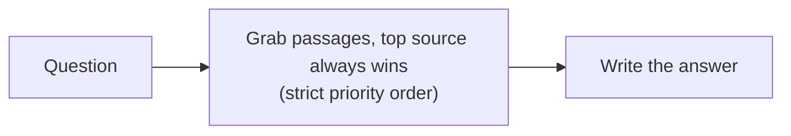
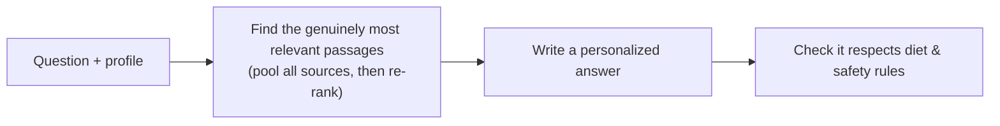
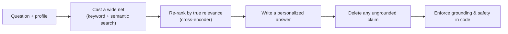

# Poshan Saathi — A Nutrition RAG Chatbot for Pregnant Indian Women

**TL;DR**: Poshan Saathi ("nutrition companion" in Hindi) is a RAG chatbot I built to answer pregnancy-nutrition questions for women in India. 

**The problem**: The Indian diaspora has specific dietary requirements (ovo-vegetarian and vegetarian are common) and medical conditions (anemia and diabetes are common), while most maternal nutrition advice is generic, unsourced, or written for a Western diet. 

**My solution**: I built a system designed specifically for the Indian pregnant woman, sourcing nutritional guidance directly from India's Ministry of Health, India's FOGSI obstetrics federation, and the WHO as a fallback, while tailoring every answer to the woman's diet, trimester, and medical conditions.

**Why this problem**: I was a quarterfinalist for The Gates Foundation’s AI Fellow Program (top 20/4500+ applicants, ie top 0.4%) where we were asked to build a prototype of an antenatal chatbot. I chose to bring my prototype to production using state-of-the-art RAG techniques to upskill my AI skillset and to bring a working solution to a real problem! Here’s a peek into how I approached this project. 🥰

#### [Click here](https://github.com/user-attachments/files/31110413/Prenatal.chatbot.demo.pdf) for a quick demo of the prenatal chatbot or interact with it live at [the deployed website here](https://prenatal-rag-chatbot.vercel.app/).

---

**Table of Contents:**
A preview of what's in this README so you can pick and choose sections of interest or peruse through them all. :) 

1. [Technology stack](#1-technology-stack)
2. [Results at a glance](#2-results-at-a-glance)
2a. [Deconstructing the metrics](#2a-deconstructing-the-metrics)
3. [Approaching the challenge](#3-approaching-the-challenge)
4. [Choosing the data, ie the knowledge base](#4-choosing-the-data-ie-the-knowledge-base)
5. [Architecture diagram](#5-architecture-diagram)
6. [My philosophy behind the decisions I made](#6-my-philosophy-behind-the-decisions-i-made)
7. [How the pipeline evolved](#7-how-the-pipeline-evolved)
8. [Where things live](#8-where-things-live)

---

## 1. Technology stack

| Layer | Technologies |
|---|---|
| **Frontend** | Next.js, React, TypeScript, Tailwind CSS, Vercel |
| **Backend** | FastAPI, Python, Upstash Redis, Docker, Render |
| **AI / RAG** | OpenAI, Pinecone, BM25, LangChain, LlamaIndex |
| **Observability & Eval** | Langfuse, RAGAS, Claude |
| **Dev Tooling** | Claude Code, Git, GitHub |

---

## 2. Results at a glance

I evaluated across 30 diverse test cases using RAGAS and a cross-vender judge (Claude) on these 3 core metrics to assess the system's performance. Here are the results averaged over 3 runs to take variance into account:

| Metric                | Score     | In plain English                                                                              |
| --------------------- | --------- | --------------------------------------------------------------------------------------------- |
| **Context precision** | **0.92** | How well did we rank and retrieve the relevant chunks given the user's input?                |
| **Faithfulness**      | **0.85** | How faithful is each claim? (ie how well is it *not* hallucinating?) |
| **Answer relevancy**  | **0.93** | How relevant is our answer to the user's question?                                            |

### 2a. Deconstructing the metrics
The core of my approach was built around these 3 metrics, as I iteratively built my solution based on how these metrics were moving. Here's a quick motivation for why these 3 metrics cover the system performance end-to-end. 

---

## 3. Approaching the challenge
**Co-creating with user research**: As someone who has not personally experienced pregnancy, I knew from the start that co-creating with real user input was essential. To understand the realities of pregnancy, I conducted a user interview with my mom. I learned that as an Indian vegetarian, she struggled to get nutritional guidance specific to her diet. Recognizing that the Indian diaspora has diverse dietary restrictions, I realized I could design this product to meet their specific needs.

**Following AI frameworks & ethical guidelines**: I guided my vision, approach, and inspiration from [The Gates Foundation's AI guiding principles](https://www.gatesfoundation.org/ideas/articles/artificial-intelligence-ai-development-principles) and [the projects it has funded](https://www.gatesfoundation.org/about/committed-grants?q=maternal%20health#committed_grants). Since I was designing for Indian citizens, I ensured national AI governance rules were met by following [its ethical guidelines](https://www.icmr.gov.in/icmrobject/custom_data/pdf/Ethical-guidelines/Ethical_Guidelines_AI_Healthcare_2023.pdf).

**Personalizing the user experience**: I used the 3 common diets in the Indian diaspora (fun fact: every food item in India has a 🟢/🟡/🔴 label to denote what animal product may be in the ingredients), common medical conditions, and the metric system to personalize the user experience to Indians. Even the name, Poshan Saathi (nutritional companion), is meant to evoke comfort in Hindi, a native language in India.

| Dimension                 | What I designed for                                   |
| ------------------------- | ----------------------------------------------------- |
| Diet                      | 🟢 Vegetarian, 🟡 Ovo-Vegetarian, 🔴 Non-Vegetarian    |
| Common medical conditions | Anemia (low iron), Hypertension, Diabetes             |
| Units                     | Metric (kg, cm) — India uses the metric system        |

---

## 4. Choosing the data, ie the knowledge base

The point of this project was to upskill in AI/RAG to produce reliable answers from vetted, pertinent data sources instead of using a general LLM (ie ChatGPT), so I chose which data to include thoughtfully: 

- **Prioritizing localization**: To keep answers locally relevant, I prioritized / ordered by: regional governing body (India’s MoHFW), then regional professional organization (India’s FOGSI), and finally defaulted to global organization (WHO). 

- **Data freshness**: All sources were published in the last 5 years to ensure most up-to-date guidelines. 

- **Scaling**: I created a knowledge_base_dictionary table to maintain the metadata of the data pulled to maintain data hygiene as the number of sources would grow. Perhaps we’d want to replace sources after a certain number of years, or balance how many sources from a specific origin, or weigh different sources differently, or A/B test different combinations of data sources, or keep track of different versions deployed over time, or leave remarks on the data sources. Any and more of these hypotheticals are obtainable from a simple data dictionary. :D

| doc_id | file_name | file_type | doc_title | doc_language | org_geographic_scope | org_official_name | org_display_name | doc_source | doc_year_published | doc_num_pages | doc_reference_order | doc_description | doc_intended_use |
|---|---|---|---|---|---|---|---|---|---|---|---|---|---|
| 1 | anc_guidelines_india_mohfw | pdf | Training Manual on Care During Pregnancy and Child Birth | English | India | Ministry of Health and Family Welfare | MoHFW | [PDF](https://nhsrcindia.org/sites/default/files/2021-12/Care%20During%20Pregnancy%20and%20Childbirth%20Training%20Manual%20for%20CHO%20at%20AB-HWC.pdf) | 2021 | 80 | 1 | An Indian governing body's ANC guidelines | Primary source, given doc is both regional and governing |
| 2 | anc_guidelines_india_fogsi | pdf | Routine Antenatal Care for the Healthy Pregnant Women | English | India | Federation of Obstetric and Gynaecological Societies of India | FOGSI | [PDF](https://www.fogsi.org/wp-content/uploads/2024/08/Binder_Routine-Antenatal-Care-for-the-Healthy-Pregnant-Women.pdf) | 2024 | 28 | 2 | An Indian professional organization's ANC guidelines | Secondary source, given doc is regional yet professional organization |
| 3 | anc_guidelines_global_who | pdf | WHO antenatal care recommendations for a positive pregnancy experience | English | Global | World Health Organization | WHO | [PDF](https://iris.who.int/server/api/core/bitstreams/cb09dd39-1cfc-432c-9baf-feb6a5c40aa4/content) | 2021 | 40 | 3 | A global organization's ANC guidelines | Tertiary source, given doc is global organization |

---

## 5. Architecture diagram

This architecture was built iteratively. The main components include user input → message classification → chunk retrieval → answer generation. I've broken it down in more detail in this Mermaid diagram, including the parameters used.

---

## 6. My philosophy behind the decisions I made

I made a lot of technical architectural decisions. I could list them all, but instead I'll share my broader philosophy behind my decision-making.

| Philosophy | Reasoning |
|---|---|
| **1. MVP before iterating** | My first iteration was an MVP in Jupyter notebook that took in user's question, used LlamaIndex instead of a designated vector database to do similarity search, and return results. This is also where I saw how I need to add guardrails and fallbacks to constrain the scope. Once I got a working AI prototype in Jupyter notebook, I migrated it to Claude Code to flesh out the AI more deeply, backend, frontend, and deployment aspects. |
| **2. Instrumentation as a north star** | Without any instrumentation, I was left in the dark trying random test cases and making blind judgements on my own. I quickly realized this was not scalable and added (a) **a rich, diverse test suite** that covered all different variations of my project (core_nutrition, personalization, indian_context, emergency, off_topic, edge_case, follow_up), (b) **evaluation metrics** to guide my direction (context_precision, faithfulness, answer_relevancy), and (c) finally an **observability layer** at Langfuse where I could actually track each request and response. |
| **3. Thinking of the system as a whole, not isolated components** | In a system, everything is connected: parsing affects chunking which affects retrieval which affects faithfulness. An LLM affects groundedness which affects cost and latency. Faithfulness and answer_relevancy hold an inherent tension (inverse relationship). More chunks affect context_precision. Adding hybrid search instead of dense search allows for niche phrases but also filters general phrases, so lowering similarity_threshold allows them to pass through again. Instead of thinking of any one singular change in isolation, I thought in second- and third- order effects on how the whole system would be affected. |
| **4. Debugging at the atomic layer** | One could be quick to make a recommendation based on the score of a metric, but instead, I dug at the root level to understand how the error propagated to resolve at the root layer. Otherwise, solutions are generic band-aids. When faithfulness scores were low, I traversed backwards: which cases are low? What is it responding with? What do the chunks look like? And from there, I resolved edge cases with structural cures. This is how, for instance, I learned that rare Indian-context words such as amla and jaggery were getting smoothed over by dense embeddings and required sparse embeddings to keyword capture them; I tuned to a hybrid approach that allowed for both rare words and semantic words to pass through. |
| **5. Enforcing constraints instead of relying on probabilistic answers** | Dealing with LLMs is tricky as it is probabilistic in nature, and hoping that all LLM models listen to your "please don't make things up" prompt often gets ignored. I noticed how for a vegetarian diet, I would still get non-vegetarian recommendations. Similarly, I saw subtle but real hallucinations as well. Instead of relying purely on the temperature setting or variance in runs, (a) **I more strictly enforced hard requirements by adding a gating layer that read the user's profile** (ie dietary restrictions and medical conditions) and stripped the answer of any violations. Similarly, I added (b) **a groundedness_filter that verified each claim made against the chunks**, stripping any claim not made in the chunk, before sharing it with the user - instead of waiting for my metrics to catch these issues, I proactively stopped it before it reached the user, especially since this project is in the medical space which requires even more careful attention with advice shared. Finally, (c) **I also enforced the priority order of the knowledge base**, as I wanted to prioritize localization, so I prioritized Indian governance, then Indian organization, then global organization - even if the global organization had a higher relevance, as long as a minimum similarity_threshold was met. |
| **6. Tune one variable at a time and track everything** | Given the interconnected nature of different parameters, (a) I **isolated one variable at a time** to evaluate its effect. In the same vein, I noticed there was variance across each runs, so to prevent random runs hijacking the metrics, (b) **I stabilized metrics by averaging them across 3 runs**. Finally, (c) **I tracked everything** - which parameters changed in each run and how each metric correspondingly moved. Each parameter and prompt was also versioned and tracked. |

---

## 7. How the pipeline evolved

The final architecture diagram does no justice in sharing all of the various trials and tribulations that led to it. The pipeline grew and iterated a lot until it reached its final form. Here are some snapshots of how it evolved:

**v1 — the naive first pass.** It grabbed passages, let the most authoritative source win, and answer. It was simple, but it would happily cite a barely-relevant passage just because it came from the top-priority source.

**v3 — relevant, personal, and safer.** Now candidates are gathered from every source and are re-ranked by actual relevance, tailored to the user's profile, and with a validating layer on the result.

**v5 — the current system.** Hybrid keyword+semantic search, smarter chunking, and — the big one — I stopped trusting the model to stay grounded and started enforcing it: every claim gets checked against a source, and safety rules are applied in code.

---

## 8. Where things live

| Path                           | What's there                                                                         |
| ------------------------------ | ------------------------------------------------------------------------------------ |
| `backend/app/chat/`            | The pipeline, the message classifier, and the post-answer validator                  |
| `backend/app/rag/`             | Retrieval (hybrid search + re-ranking), chunking, embedding, and HyDE (kept but off) |
| `backend/app/config.py`        | Every tunable knob, in one place, overridable by environment variable                |
| `eval/`                        | The RAGAS harness, routing tests, four user personas, and 92 archived reports        |
| `scripts/`                     | One-time ingestion plus retrieval-debugging tools                                    |
| `docs/ARCHITECTURE_HISTORY.md` | The exhaustive engineering archive                                                   |

