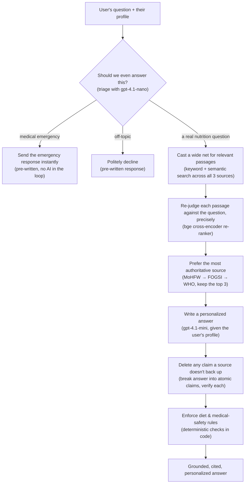
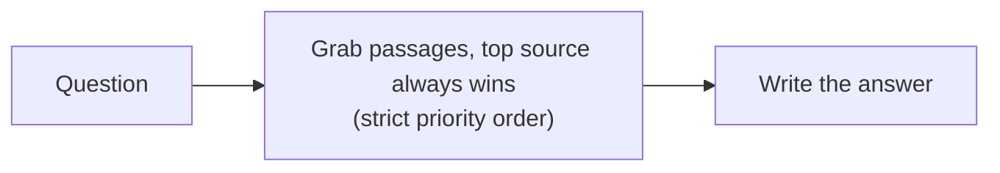
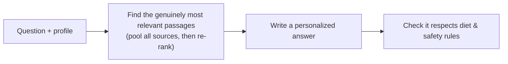
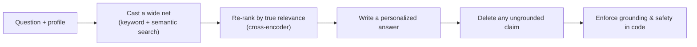

# Poshan Saathi — Prenatal Nutrition RAG Chatbot

Poshan Saathi ("nutrition companion" in Hindi) is a chatbot I built to answer pregnancy-nutrition questions for women in India. Anemia and undernutrition during pregnancy are strikingly common here, and most nutrition advice online is generic, unsourced, or written for a Western diet. I wanted the opposite: answers a user could actually trust. So the entire system is designed around one rule — it only ever says things that trace back to one of three authoritative sources (India's Ministry of Health, the FOGSI obstetrics federation, and the WHO) — and it tailors every answer to the person asking: their diet, their trimester, their medical conditions.

I built this as a portfolio piece for a **backend / senior AI-engineer** role, so this README is about the engineering underneath the chatbot — how retrieval works, how I keep the model from making things up, and how I measured whether any of it was actually good. There's no UI yet (a simple frontend is planned); the backend and the evaluation harness are the real substance, and they're what I document here.

**From a one-day notebook to a production system.** This didn't start as anything serious. It began as a quick-and-dirty Jupyter notebook I threw together in a day — load a PDF, embed it, ask a question, get a plausible-looking answer. That was enough to prove the idea, but nowhere near trustworthy: I had no way to see what the system was doing, no way to measure whether an answer was actually any good, and nothing stopping it from confidently making things up. Turning that demo into what's here meant building all the parts a one-day prototype skips — observability and tracing, a real evaluation harness with metrics and persona-based test cases, deliberate chunking and re-ranking strategies, hybrid search, and hard guarantees that every answer stays faithful both to the user's profile and to what the sources actually say.

### The stack

| Layer | Choice |
|---|---|
| API | FastAPI |
| Vector search | Pinecone — hybrid keyword + semantic |
| Embeddings | OpenAI `text-embedding-3-small` (1536-dim) |
| Answer model | OpenAI `gpt-4.1-mini` |
| Message classifier | OpenAI `gpt-4.1-nano` (temperature 0) |
| Re-ranker | Self-hosted `bge-reranker-v2-m3` cross-encoder |
| Evaluation | RAGAS with a cross-vendor Claude judge |
| Tracing | Langfuse v4 |

---

## Why this problem, and who it's for

I deliberately narrowed the scope to something I could do *well* rather than something broad and shallow. I chose **not** to touch urgent situations or anything requiring a diagnosis: doing that responsibly demands a much more careful approach to minimizing harm than a project this size can honestly promise, so those messages get caught and redirected instead of answered. I also left out recommended visit schedules, because whether someone can actually keep an appointment depends on transportation, time off work, and money — factors a nutrition bot has no business pretending to solve. What's left — trusted, personalized, everyday nutrition guidance during pregnancy — felt both genuinely useful and realistically achievable.

And it's built specifically for **Indian women**, not adapted from a Western default. That shows up in the personalization: the diets people here actually eat, the medical conditions that are common in Indian pregnancies, and even the units of measurement.

| Dimension | What I designed for |
|---|---|
| Diet | Vegetarian, ovo-vegetarian, non-vegetarian |
| Common conditions | Low iron (anemia), hypertension, diabetes / GDM |
| Units | Metric (kg, cm) — what Indian users actually think in |

The design leans on the same instinct: keep it culturally familiar. The app is named in the local language — *Poshan Saathi*, "nutrition companion" — and the personas and framing use familiar, friendly names rather than clinical placeholders, so it feels like something built for the user rather than translated at them.

## What guided my decisions

The scope and design weren't guesses — they came from user research plus a few sources I trusted to keep me honest about using AI responsibly in a health and cultural context. I drew on the [Gates Foundation's AI development principles](https://www.gatesfoundation.org/ideas/articles/artificial-intelligence-ai-development-principles) and looked at the [maternal-health projects it has funded](https://www.gatesfoundation.org/about/committed-grants?q=maternal%20health#committed_grants) for how to apply AI in a culturally appropriate way. And to make sure I stayed within India's own expectations for health AI, I followed the [ICMR's Ethical Guidelines for AI in Healthcare (2023)](https://www.icmr.gov.in/icmrobject/custom_data/pdf/Ethical-guidelines/Ethical_Guidelines_AI_Healthcare_2023.pdf) as I made design and safety choices.

## The knowledge base

Everything the bot can say traces back to a small, curated knowledge base of three trusted documents, each described in an annotated data dictionary. They all come from official sources but differ in scope, so — since this is a *local* prototype meant to fit *local* needs — I consult them in a deliberate order of authority: the Indian governing body first, then the Indian professional body, then the global one. That ordering is a first-class part of retrieval, not an afterthought.

| Priority | Source | Why it ranks here |
|---|---|---|
| 1 | **MoHFW** — India's Ministry of Health & Family Welfare | The national governing body; most directly speaks to local guidance |
| 2 | **FOGSI** — Federation of Obstetric & Gynaecological Societies of India | India's professional obstetrics body; authoritative and local |
| 3 | **WHO** — World Health Organization | Global and rigorous, but not India-specific — the fallback |

## Does it work? Results at a glance

I score answer quality with RAGAS on three metrics. Here's the canonical run (averaged over multiple runs to smooth out noise):

| Metric | Score | In plain English |
|---|---|---|
| **Faithfulness** | **0.853** | Does every claim in the answer actually come from a source? (i.e. is it *not* hallucinating?) |
| **Answer relevancy** | **0.933** | Does the answer actually address what was asked? |
| **Context precision** | **0.917** | Did we retrieve the *right* passages, ranked well? |

But honestly, the number isn't the interesting part. The interesting part is what I learned getting there: on a small evaluation set, the faithfulness score turned out to be **dominated by noise** — the same answer could score anywhere from 0.0 to 0.78 depending on the judge's mood that run. Realizing that changed how I worked. I stopped chasing prompt tweaks and started fixing the *structure* and *reducing the noise itself*. That story is in [What actually helped](#what-actually-helped-and-what-didnt) below.

If you want the exhaustive version — every decision, every tuning run, every dead-end, cross-checked against the git history and 92 evaluation reports — it lives in [`docs/ARCHITECTURE_HISTORY.md`](docs/ARCHITECTURE_HISTORY.md). This README is the guided tour.

---

## How it works

Here's the whole pipeline. Each box says **what the step is trying to do**, with the tool or technique it uses in parentheses underneath. Notice that emergencies and off-topic messages get caught *before* any search happens — a medical emergency should never sit waiting on the AI pipeline.



**Why is there a separate re-ranking step?** This is the part I'm most glad I dug into, so it's worth explaining. The first search is fast but a little blunt: it scores each passage against the question on its own, using vectors computed ahead of time. That's perfect for casting a wide net, but its sense of "relevant" is coarse. A cross-encoder re-ranker is the opposite — it reads the question and a passage *together*, in one pass, so it can tell "actually answers this" from "vaguely related" far more accurately. The catch is it's slow, so you can't run it over the whole corpus. The trick is to use both: let the cheap search shortlist ~15 candidates, then let the accurate-but-slow re-ranker pick the best 3. Recall first, precision second. When I first saw the re-ranker giving everything scores like 0.01, I assumed the re-ranker was broken — but digging into the actual passages showed the real problem was upstream in how I was *chunking* the documents. That kind of "follow it to the real cause" moment happened a lot on this project.

---

## The philosophy behind the decisions

If I had to point to the one thing that made this project work, it wouldn't be a model or a library — it would be building the ability to *see and measure* what the system was doing before trying to improve it. That instinct is the first of several ideas that shaped almost every decision below. Here they are at a glance, each with the concrete moment on this project that taught it to me.

| Principle | What it means | Where it showed up |
|---|---|---|
| **Instrument before you optimize** | You cannot fix what you cannot see — build tracing and evaluation *first*, then let them drive the work | I only found that *every* retrieved passage was coming from one source, and that near-zero re-ranker scores were really a *chunking* problem, by staring at Langfuse traces and reading the actual passages |
| **Trust a number only once you know how noisy it is** | A single measurement can lie; pin down the variance before believing a result | The same answer scored anywhere from 0.0 to 0.78 across judge runs, so temperature 0 and multi-run averaging came *before* I claimed any change had worked |
| **Isolate one variable before blaming anything** | Change one thing at a time, and prove the cause before attributing it | A faithfulness drop that looked *obviously* like the new document parser turned out — after a git-bisect — to be an unrelated prompt change; the obvious culprit was innocent |
| **Think in second-order effects** | The knobs aren't independent — trace the ripples before flipping a switch | Turning on hybrid search quietly filtered out water-intake queries, so I lowered the threshold, which then had to still surface rare words like *amla* — one change forcing three |
| **No untunable magic numbers** | Put the intent in the *structure*, not in hand-tuned knobs someone has to babysit | I rejected additive source-priority nudges (+0.02 for the top source); instead priority lives in the *ordering* — sort by authority, then relevance — with nothing to hand-tune |
| **Recalibrate — don't rip it out** | When a safeguard mis-fires after a change, re-tune it for the new regime rather than deleting it | My relevance threshold mis-fired after the switch to hybrid search; the fix was re-tuning it, not removing the filter |
| **Enforce in code what you can detect mechanically** | If you can catch it with a check or a regex, don't demote it to a hopeful prompt instruction | Small models ignore "don't make things up" even at temperature 0, so ungrounded claims, evasive openers, and "180 days" → "daily" rewrites get caught by a real verification pass |

---

## How I debug a bad answer

Aggregate scores tell you *something's* off; they don't tell you *what*. So when a run comes back with a few weak cases, I go one by one and trace each answer down to the layer that actually caused the problem. On a small set I read the outputs by hand; at scale I let the eval scores point me at the cases worth opening. The loop is roughly this:

1. **Read the answer first.** Is it genuinely wrong, is it evasive and non-committal, or is it actually fine but scored harshly? (RAGAS, for example, would hand a 0 to an answer that *opened* with "the guidelines don't say, but a related point is…" even when that related point was correct — a scoring quirk to work around, not a bad answer.)
2. **Look at what was retrieved.** Did the right source passage even come back? If it didn't, the problem is upstream — chunking, the search signal, or the threshold — and no amount of prompt tuning will save it.
3. **If the right passage came back but ranked low**, it's a re-ranking problem.
4. **If the right passage is there and ranked well but the answer ignored it or hedged**, it's a prompt problem — too strict, or contradicting itself with its own examples.
5. **If the answer said something that isn't in any passage**, it's a grounding problem, and it belongs in the verification pass, not in a politely-worded prompt.

Then I fix at that layer and re-run. A few real cases this led to: near-zero re-ranker scores that turned out to be a *chunking* problem (long chunks burying the one relevant sentence); every passage coming from a single source (a fix to how I pooled and ordered candidates); and a faithfulness score that swung wildly run to run, which was a *measurement-noise* problem — solved with temperature 0 and averaging, not by touching the answer code at all.

> **From my project notes:** *"It's been really fun looking at the actual outputs and seeing where to make tweaks. On a small set I can read them by hand; at scale I look at the eval scores, find the low ones, and dig in — is the answer wishy-washy? What do the retrieved passages look like? Is it the re-ranking, the selection, or a too-strict prompt?"*

---

## The key decisions, and why I made them

Every choice here is an "I picked X over Y, because Z, and here's what it cost." The reasoning matters more than the picks.

| Decision | I chose | Over | Because | What it cost |
|---|---|---|---|---|
| **How I debug & iterate** | A full tracing + evaluation layer | Ad-hoc prints and eyeballing outputs | I couldn't make sound architectural calls blind — I needed to see every intermediate step and put a number on every change (this is what surfaced nearly every problem below) | Upfront time building Langfuse tracing, test cases, and a RAGAS suite before the "real" work |
| **Safety guardrails** | An LLM classifier | Keyword matching | Keyword rules flagged *"keep my blood sugar in check"* as an emergency (it contains "blood") and missed real emergencies phrased without any trigger word | One extra quick LLM call per message — an easy trade in a health setting |
| **Retrieval** | Pool everything, then re-rank | A strict "top source always wins" waterfall | The waterfall let a barely-relevant top-source passage beat a highly-relevant one from another source; pooling then re-ranking fixes relevance while I keep source priority in the final *ordering* | A bit more compute per question |
| **Re-ranker hosting** | Self-hosting the bge model | Pinecone's hosted re-ranker, or Cohere | I hit Pinecone's free monthly limit, and bge is already top-tier — Cohere's "state of the art" pitch didn't justify a new paid dependency | A one-time ~600 MB model download; it runs locally |
| **Chunking** | Semantic + header-aware splitting | Fixed 600-character chunks | Passages were scoring ~0.01 not because re-ranking was broken, but because long chunks buried the one relevant sentence — the fix was upstream | Chunks vary in length, so I added a token cap as a backstop |
| **Search signal** | Hybrid keyword + semantic | Pure semantic search | Rare Indian-context words (amla, ragi, jaggery) need literal keyword matching that semantic embeddings smooth over | It briefly hurt precision until I recalibrated the threshold |
| **Personalization** | A strict profile schema | Free-form prompt text | The system refuses to even start if any diet or condition is missing its rule, so personalization can never silently disappear | Essentially free — it's stricter, not slower |
| **Anti-hallucination** | A verification pass in code | Trusting the prompt | The model ignored "don't make things up" even at temperature 0; a claim-by-claim check enforces grounding mechanically | One always-on verification call per answer |
| **Evaluation judge** | RAGAS + a Claude judge | A custom judge, or a GPT judge | Using Claude to grade GPT's answers avoids a model quietly favoring its own family, and a standard framework beats a scoring rubric I'd have to defend myself | Needs an Anthropic key, but only for evaluation |
| **Answer model** | `gpt-4.1-mini` | The cheaper `gpt-4.1-nano` | nano was just as faithful, but mini gave a reliable relevancy bump (0.88 → 0.93) with steadier results | ~5× nano's price — negligible at this volume |

---

## How the pipeline grew up

The architecture went through five real versions over about three months. I'm showing how the *shape* changed rather than a tidy "scores went up" chart, because — as I explain in the next section — the scores didn't climb so much as plateau, and pretending otherwise would be dishonest. Here are three representative stages, with the same "what it does" labeling as before.

**v1 — the naive first pass.** Just grab passages, let the most authoritative source win, and answer. Simple, but it would happily cite a barely-relevant passage just because it came from the top-priority source.



**v3 — relevant, personal, and safer.** Now I gather candidates from every source and re-rank them by actual relevance, tailor the answer to the user's profile, and run a first safety check on the result.



**v5 — the current system.** Hybrid keyword+semantic search, smarter chunking, and — the big one — I stopped trusting the model to stay grounded and started enforcing it: every claim gets checked against a source, and safety rules are applied in code.



---

## What actually helped (and what didn't)

Here's the most senior thing I took away from this project: **the scores plateaued, they didn't climb.** After the first few weeks, all three metrics bounced around inside a band of noise that was wider than most of my individual changes. So instead of taking credit for every wiggle, I started asking which changes actually *held up* once I averaged across many runs.

**The things that genuinely moved the needle were structural, not cosmetic:**
- Switching to a cross-vendor judge (Claude grading GPT), which removed a subtle score inflation.
- Enforcing personalization through a schema instead of hoping the prompt remembered.
- The claim-by-claim grounding check and the in-code safety rules — enforced, not requested.
- Trimming the candidate pool so fewer weak passages made it through.
- And — just as important — **reducing the noise itself**, with temperature 0 and multi-run averaging, because until I did that I literally couldn't tell signal from luck.

**And the dead-ends, which I kept in the record on purpose** — a measured failure is worth more than an untested success:

| Dead-end | Why I walked it back |
|---|---|
| **HyDE** (a query-rewriting trick) | Made every metric worse on this structured-guideline corpus — a good re-ranker already does what HyDE is meant to |
| **"Temperature 0.1 is better"** | Turned out to be a single noisy measurement — exactly the trap I later learned to avoid |
| **Cohere's re-ranker** | I'd framed it as the "SOTA" upgrade, then realized my constraint was hosting cost, not model quality |
| **A hardcoded forbidden-foods list** | Too rigid to tell "avoid chicken" from "include chicken," so it became the smarter LLM-based validator instead |

The full run-by-run detail is in [`docs/ARCHITECTURE_HISTORY.md`](docs/ARCHITECTURE_HISTORY.md).

---

## Running it yourself

```bash
# 1. Install (editable, so imports resolve from anywhere)
pip install -e .

# 2. Configure — copy the template and add your keys
cp .env.example .env      # OpenAI + Pinecone required; Anthropic only for eval

# 3. One-time setup: parse the PDFs, chunk, embed, and load into Pinecone
python -m scripts.ingest

# 4. Start the API
uvicorn backend.app.main:app --reload
#   POST /chat   → { message, user_profile } → a grounded, cited answer
#   GET  /health

# 5. Score answer quality (RAGAS, averaged over 3 runs)
python -m eval.ragas_eval --runs 3
```

## Where things live

| Path | What's there |
|---|---|
| `backend/app/chat/` | The pipeline, the message classifier, and the post-answer validator |
| `backend/app/rag/` | Retrieval (hybrid search + re-ranking), chunking, embedding, and HyDE (kept but off) |
| `backend/app/config.py` | Every tunable knob, in one place, overridable by environment variable |
| `eval/` | The RAGAS harness, routing tests, four user personas, and 92 archived reports |
| `scripts/` | One-time ingestion plus retrieval-debugging tools |
| `docs/ARCHITECTURE_HISTORY.md` | The exhaustive engineering archive |
